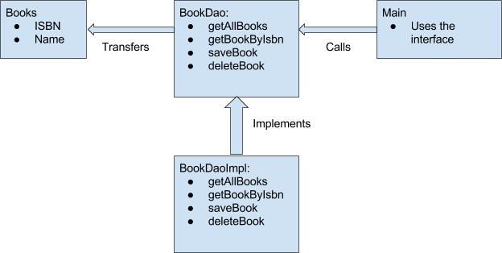

## DAO Design Pattern

DAO stands for Data Access Object. DAO Design Pattern is used to separate the data persistence logic in a separate layer. This way, the service remains completely in dark about how the low-level operations to access the database is done. This is known as the principle of Separation of Logic.

With DAO design pattern, we have following components on which our design depends:
1. The model which is transferred from one layer to the other.
2. The interfaces which provides a flexible design.
3. The interface implementation which is a concrete implementation of the persistence logic.

## Implementing DAO pattern
With above mentioned components, let’s try to implement the DAO pattern. We will use 3 components here:

1. The Book model which is transferred from one layer to the other.
2. The BookDao interface that provides a flexible design and API to implement.
3. BookDaoImpl concrete class that is an implementation of the BookDao interface.

Let us put this logic into a diagram:

## Advantages of DAO pattern
There are many advantages for using DAO pattern. Let’s state some of them here:

1. While changing a persistence mechanism, service layer doesn’t even have to know where the data comes from. For example, if you’re thinking of shifting from using MySQL to MongoDB, all changes are needed to be done in the DAO layer only.
2. DAO pattern emphasis on the low coupling between different components of an application. So, the View layer have no dependency on DAO layer and only Service layer depends on it, even that with the interfaces and not from concrete implementation.
3. As the persistence logic is completely separate, it is much easier to write Unit tests for individual components. For example, if you’re using JUnit and Mockito for testing frameworks, it will be easy to mock the individual components of your application.
4. As we work with interfaces in DAO pattern, it also emphasizes the style of “work with interfaces instead of implementation” which is an excellent OOPs style of programming.