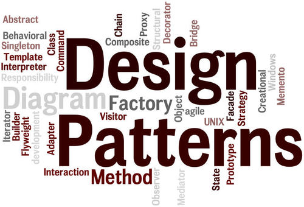

<h1 align="center">
 	
 	 
 	 
 </h1>

# Design patterns  

In software engineering, a software design pattern is a general reusable solution to a commonly occurring problem within a given context in software design. It is not a finished design that can be transformed directly into source or machine code. It is a description or template used to know how to solve a problem that can be used in many different situations. Design patterns are formalized best practices that a programmer can use to solve common problems while designing an application or system.
Design patterns may be viewed as a structured approach to computer programming intermediate between the levels of a programming paradigm and a concrete algorithm.

## List of implementations

* [Behavioral](Behavioral)
  * [Chain Of Responsibility](Behavioral/ChainOfResponsability)
  * [Command](Behavioral/Command)
  * [Iterator](Behavioral/Iterator)
  * [Null Object](Behavioral/NullObject)
  * [Observer](Behavioral/Observer)
  * [State](Behavioral/State)
  * [Strategy](Behavioral/Strategy)
  * [Template Method](Behavioral/TemplateMethod)
  * [Visitor](Behavioral/Visitor)
  * [Interpreter](Behavioral/Interpreter)
  * [Mediator](Behavioral/Mediator)
* [Concurrency](Concurrency)
  * [Active Object](Concurrency/Active%20Object)
  * [Balking Pattern](Concurrency/Balking%20Pattern)
  * [Concurrent Server](Concurrency/Concurrent%20Server)
  * [Fan Out](Concurrency/Fan%20Out)
  * [Guarded Suspension](Concurrency/Guarded%20Suspension)
  * [Mutext](Concurrency/Mutex)
  * [Semaphores](Concurrency/Semaphores)
* [Creational](Creational)
  * [Abstract Factory](Creational/Abstract%20Factory)
  * [Builder](Creational/Builder)
  * [Dependency Injection](Creational/Dependency%20Injection)
  * [Factory](Creational/Factory)
  * [Lazy Initialization](Creational/LazyInitialization)
  * [Method Chaining](Creational/Method%20Chaining)
  * [Prototype](Creational/Prototype)
  * [Singleton](Creational/Singleton)
  * [Value Object](Creational/Value%20Object)
* [Structural](Structural)
  * [Adapter](Structural/Adapter)
  * [Bridge](Structural/Bridge)
  * [Composite](Structural/Composite)
  * [Decorator](Structural/Decorator)
  * [Flyweight](Structural/Flyweight)
  * [Facade](Structural/Facade)
  * [Repository](Structural/Repository)
  * [PrivateClass](Structural/PrivateClass)
  * [Proxy](Structural/Proxy)

## Contribution
 * Contributions are always welcome. Language doesn't matter. Just make sure you're implementing design pattern.
 * PRs are welcome. To begin developing, follow the structure:

   > category/design pattern name/language-name/file_name.extension

   e.g

   > Creational/Abstract factory/python/abstract_factory.py
 * Don't forget to add README with explanation how pattern works, when to use and common usage of the pattern.
 * Adding image with UML diagram for design pattern would be very helpful.

## Resources

 Curated list of resources dealing with design patterns.

 * Books
   * [Head First Design Patterns: A Brain-Friendly Guide](https://www.amazon.com/gp/product/0596007124/ref=as_li_qf_sp_asin_il_tl?ie=UTF8&camp=1789&creative=9325&creativeASIN=0596007124&linkCode=as2&tag=anjabl-20)
   * [Elements of Reusable Object-Oriented Software](https://www.amazon.com/gp/product/0201633612/ref=as_li_qf_sp_asin_il_tl?ie=UTF8&camp=1789&creative=9325&creativeASIN=0201633612&linkCode=as2&tag=anjabl-20)
   * [Design Patterns Explained: A New Perspective on Object Oriented Design](https://www.amazon.com/dp/0321247140/?tag=myga0ba-20)
   * [Patterns of Enterprise Application Architecture](https://www.amazon.com/dp/0321127420/?tag=myga0ba-20)
 * Free e-books
   * [Design Pattern in C++](http://www.uml.org.cn/c++/pdf/DesignPatterns.pdf)
   * [Design Pattern in Javascript](http://sd.blackball.lv/library/Mastering_JavaScript_Design_Patterns_(2014).pdf)
 * Sites
   * [Design patterns](http://www.oodesign.com/)
   * [Geeks for geeks design patterns](http://www.geeksforgeeks.org/software-design-patterns/)
   * [Source making Design patterns](https://sourcemaking.com/design_patterns)
   * [Java Desgin Pattens Example tutorial](https://www.journaldev.com/1827/java-design-patterns-example-tutorial)
 * Online classes (Free)
   * [Design Patterns - Coursera](https://www.coursera.org/courses?query=design%20patterns)
   * [Hackr.io list ](https://hackr.io/tutorials/learn-software-design-patterns)

 ## License

To the extent possible under law, [Zoran Pandovski](https://github.com/ZoranPandovski/) has waived all copyright and related or neighboring rights to this work.
